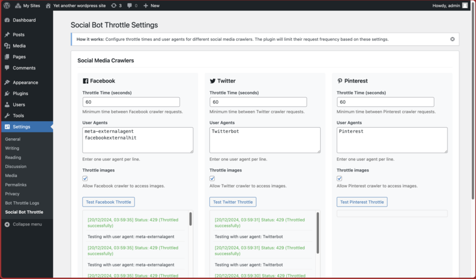

# Social Bot Request Throttle WordPress Plugin

A WordPress plugin designed to limit request frequency from various social media web crawlers. This ensures that your website does not experience excessive loads from rapid and frequent requests by social media crawlers.

## Features:
- Throttle request rates from multiple social media crawlers (Facebook, Twitter, Pinterest, and custom bots)
- Configurable throttle times for each social platform
- Customizable user agent detection
- Optional image request throttling for each crawler
- Return a `429 Too Many Requests` response for rate-limited requests
- Built-in testing tools for each crawler configuration
- Comprehensive logging capabilities for debugging
- Admin interface for easy configuration

## Installation:
1. Download the plugin code
2. Upload the `social-bot-throttle` folder to the `/wp-content/plugins/` directory of your WordPress site
3. Activate the plugin through the 'Plugins' menu in WordPress

## Configuration:
The plugin can be configured through the WordPress admin interface at Settings > Social Bot Throttle. Default settings include:

- **Facebook Throttle**: 60 seconds between requests
- **Twitter Throttle**: 60 seconds between requests
- **Pinterest Throttle**: 60 seconds between requests

For each social platform, you can configure:
- Throttle time in seconds
- User agent strings (one per line)
- Whether to throttle image requests

You can also add custom crawler configurations with their own throttle settings.

## Usage:
Once activated and configured, the plugin will automatically:
1. Monitor incoming requests and identify social media crawlers
2. Apply throttling based on your configuration
3. Return appropriate HTTP responses (200 for allowed requests, 429 for throttled requests)
4. Log request details for monitoring and debugging

## Troubleshooting:
1. **No last access time found**: This is normal for first-time requests from a crawler or after the transient has expired
2. **Failed to set last access time**: Check your WordPress transient storage system and database permissions
3. **Test your configuration**: Use the built-in test buttons in the admin interface to verify your settings

## Author:
Nadim Tuhin  
[Website](https://nadimtuhin.com)

## License:
This project is open-source and licensed under GPL-2.0+. Feel free to use, modify, and distribute it as you see fit. However, proper attribution is appreciated.

## Contributing:
If you find any issues or would like to add new features, feel free to open a pull request or raise an issue on this GitHub repository.

---

For any additional assistance or queries, visit the author's [website](https://nadimtuhin.com).
